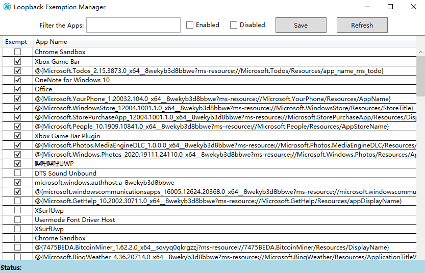

# Project Description

GUI to enable Loopback Exemptions for Universal Windows Apps and Windows 8, 8.1, 10 Modern UI Apps 

By default, Windows Modern UI and Universal Apps are forbidden to send network traffic to the local Computer. In order to debug Apps with a tool, we need to enable Loopback capabilities for those Apps.
This tool enables the management of the Apps that can connect to the local Computer.

# More information about this topic
- [Revisiting Fiddler and Win8+ Immersive applications](https://docs.microsoft.com/en-us/archive/blogs/fiddler/revisiting-fiddler-and-win8-immersive-applications])
- [Fiddler and Windows 8 Metro-style applications](https://docs.microsoft.com/en-us/archive/blogs/fiddler/fiddler-and-windows-8-metro-style-applications)
- [How to enable loopback and troubleshoot network isolation (Windows Store apps)](https://docs.microsoft.com/en-us/previous-versions/windows/apps/hh780593(v=win.10))

# Network Isolation APIs
Check the source code of this project on a sample usage of the Network Isolation APIs : 
NetworkIsolationEnumAppContainers 
NetworkIsolationFreeAppContainers 
NetworkIsolationGetAppContainerConfig 
NetworkIsolationSetAppContainerConfig

This tool does basically the same thing as Fiddler EnableLoopback Utility.

Thanks to [Eric Lawrence](http://stackoverflow.com/users/126229/ericlaw) for helping with the PInvokes.
